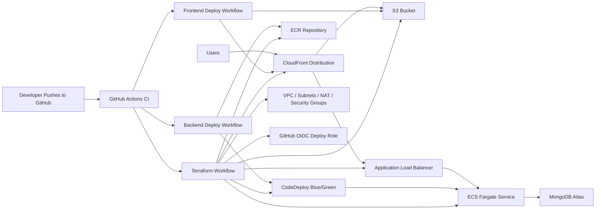

# AWS CI/CD Guide

This repository includes a practical AWS deployment model that works well for a DevOps project and maps cleanly to the current MERN app.

## Recommended Architecture



## What Each Workflow Does

### CI

File: [/.github/workflows/ci.yml](C:/Users/buv36/Documents/New%20project/.github/workflows/ci.yml)

- Runs on push and pull request
- Installs dependencies with `npm ci`
- Verifies the backend import path
- Builds the frontend

### Terraform AWS

File: [/.github/workflows/terraform-aws.yml](C:/Users/buv36/Documents/New%20project/.github/workflows/terraform-aws.yml)

- Validates Terraform on pull requests
- Supports manual `plan` or `apply`
- Uses remote state in S3 with S3 lockfiles

### Deploy Backend

File: [/.github/workflows/deploy-backend.yml](C:/Users/buv36/Documents/New%20project/.github/workflows/deploy-backend.yml)

- Builds the API Docker image
- Pushes the image to ECR
- Pulls the current ECS task definition
- Replaces the image tag
- Starts a CodeDeploy blue/green deployment for the ECS service

### Deploy Frontend

File: [/.github/workflows/deploy-frontend.yml](C:/Users/buv36/Documents/New%20project/.github/workflows/deploy-frontend.yml)

- Builds the React app
- Uploads built assets to S3
- Sets cache headers
- Invalidates CloudFront

## Terraform Resources Included

Terraform lives in [infra/aws](C:/Users/buv36/Documents/New%20project/infra/aws).

It creates:

- VPC
- Public and private subnets
- Internet gateway and NAT gateway
- Security groups
- ALB and blue/green target groups
- ECS cluster, task definition, and service
- CodeDeploy application and deployment group
- ECR repository
- CloudWatch log group
- S3 frontend bucket
- CloudFront distribution
- GitHub Actions deployment role if OIDC provider ARN is supplied

CloudFront is configured with two origins:

- S3 for the React SPA
- ALB for `/api/*`

## Before First Deployment

### 1. Create Terraform remote state resources

Create these once in AWS:

- S3 bucket for Terraform state

Example names:

- `smart-request-hub-tf-state`

### 2. Create a GitHub OIDC provider in AWS IAM

This workflow assumes an existing OIDC provider for:

```text
token.actions.githubusercontent.com
```

If you already use GitHub OIDC in AWS, reuse that provider ARN and pass it into Terraform.

### 3. Prepare MongoDB

Use MongoDB Atlas for the simplest path.

Your ECS tasks must be able to reach the MongoDB endpoint, and Atlas must allow the ECS outbound IP path or your selected network integration.

## GitHub Repository Variables

Set these as GitHub Actions repository variables:

- `AWS_REGION`
- `ECR_REPOSITORY`
- `ECS_CLUSTER`
- `ECS_SERVICE`
- `ECS_CONTAINER_NAME`
- `ECS_CONTAINER_PORT`
- `ECS_TASK_DEFINITION_FAMILY`
- `CODEDEPLOY_APPLICATION`
- `CODEDEPLOY_DEPLOYMENT_GROUP`
- `FRONTEND_BUCKET`
- `CLOUDFRONT_DISTRIBUTION_ID`
- `VITE_API_BASE_URL`
- `TF_STATE_BUCKET`
- `TF_STATE_KEY`
- `GITHUB_OIDC_PROVIDER_ARN`

Recommended values after Terraform applies:

- `AWS_REGION`: your region, for example `ap-south-1`
- `ECR_REPOSITORY`: Terraform output `ecr_repository_name`
- `ECS_CLUSTER`: Terraform output cluster name
- `ECS_SERVICE`: Terraform output service name
- `ECS_CONTAINER_NAME`: Terraform output container name
- `ECS_CONTAINER_PORT`: Terraform output `backend_container_port`
- `ECS_TASK_DEFINITION_FAMILY`: Terraform output task definition family
- `CODEDEPLOY_APPLICATION`: Terraform output `codedeploy_application_name`
- `CODEDEPLOY_DEPLOYMENT_GROUP`: Terraform output `codedeploy_deployment_group_name`
- `FRONTEND_BUCKET`: Terraform output bucket name
- `CLOUDFRONT_DISTRIBUTION_ID`: Terraform output distribution id
- `VITE_API_BASE_URL`: `https://<cloudfront-domain>/api`

## GitHub Repository Secrets

Set these as secrets:

- `AWS_ROLE_ARN`
- `TF_VAR_MONGO_URI`
- `TF_VAR_JWT_SECRET`

Notes:

- `AWS_ROLE_ARN` is the GitHub Actions deployment role Terraform can create for you.
- `TF_VAR_MONGO_URI` is used during Terraform apply to inject the API runtime connection string.
- `TF_VAR_JWT_SECRET` is used during Terraform apply to inject the API runtime JWT secret.

## First-Time Infrastructure Apply

From your machine:

```bash
cd infra/aws
cp terraform.tfvars.example terraform.tfvars
```

Edit `terraform.tfvars` with your real values.

For the first infrastructure apply, keep:

```hcl
backend_desired_count = 0
```

This avoids ECS trying to start the API before your first Docker image has been pushed to ECR.

You can also set the deployment strategy:

```hcl
backend_deployment_config_name = "CodeDeployDefault.ECSCanary10Percent5Minutes"
```

Then initialize remote state and apply:

```bash
terraform init \
  -backend-config="bucket=<your-state-bucket>" \
  -backend-config="key=smart-request-hub/prod/terraform.tfstate" \
  -backend-config="region=<your-region>" \
  -backend-config="use_lockfile=true"

terraform apply
```

After apply, capture these Terraform outputs and set them as GitHub repository variables:

- `ecr_repository_url`
- `ecr_repository_name`
- `ecs_cluster_name`
- `ecs_service_name`
- `ecs_task_definition_family`
- `backend_container_name`
- `backend_container_port`
- `codedeploy_application_name`
- `codedeploy_deployment_group_name`
- `frontend_bucket_name`
- `cloudfront_distribution_id`
- `alb_dns_name`
- `github_actions_role_arn`

## Deployment Order

1. Apply Terraform infrastructure.
2. Add Terraform outputs to GitHub variables and secrets.
3. Trigger backend deployment so the first image is pushed to ECR and deployed through CodeDeploy blue/green traffic shifting.
4. Change `backend_desired_count` to `1` and apply Terraform again, or update the ECS service desired count to `1`.
5. Trigger frontend deployment.
6. Open the CloudFront URL and verify frontend-to-backend connectivity.

## Operational Notes

- The ALB is HTTP by default in this baseline, but browser traffic still stays HTTPS because CloudFront serves the SPA and proxies `/api/*` to the ALB. For a stronger production posture, add ACM certificates and HTTPS listeners on the ALB too.
- Backend releases now use ECS blue/green through CodeDeploy with separate blue and green target groups. The default traffic pattern is `CodeDeployDefault.ECSCanary10Percent5Minutes`.
- ECS tasks currently inject app secrets through Terraform variables. For a more hardened setup, move runtime secrets into AWS Secrets Manager or SSM Parameter Store and reference them from the task definition.
- CloudFront uses the default certificate and domain in this baseline. For a polished public deployment, add Route 53 and ACM for a custom domain.
- MongoDB Atlas is the recommended choice because this app is already built around MongoDB and Mongoose. Amazon DocumentDB may require compatibility adjustments.

## Useful AWS References

- GitHub OIDC for AWS credentials: [GitHub Marketplace action](https://github.com/marketplace/actions/configure-aws-credentials-action-for-github-actions)
- S3 sync command: [AWS CLI docs](https://docs.aws.amazon.com/cli/latest/reference/s3/sync.%20%20.html)
- CloudFront invalidations: [AWS docs](https://docs.aws.amazon.com/AmazonCloudFront/latest/DeveloperGuide/Invalidation_Requests.html)
- S3 static hosting overview: [AWS docs](https://docs.aws.amazon.com/AmazonS3/latest/dev/WebsiteHosting.html)
